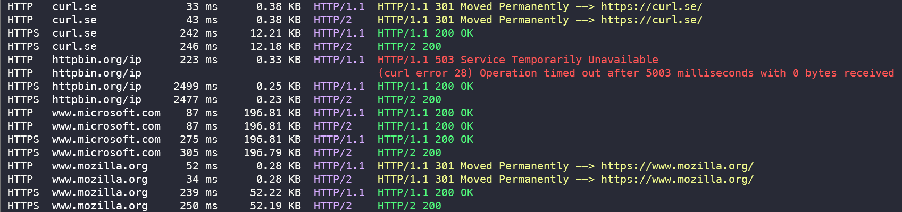

# HTTPS and HTTP/2 Request from PHP with curl

Just a simple project for testing some things with curl requests in PHP.



## Dependencies

- [league/climate](https://packagist.org/packages/league/climate)

## Setup & Run

1. Install Composer (for example in `./bin`).
2. `php bin/composer.phar install`
3. Create `config.php` and add URLs. See: [`config.php.example`](config.php.example)
4. `php src/curl.php`

## curl error 60: *"SSL certificate problem: unable to get local issuer certificate"*

Download `cacert.pem` from https://curl.se/docs/caextract.html and direct curl to where it can find it, for example via `php.ini`:

```ini
# php.ini

[curl]
curl.cainfo=C:\Users\YOUR_HOME\scoop\apps\cacert\current\cacert.pem
```
